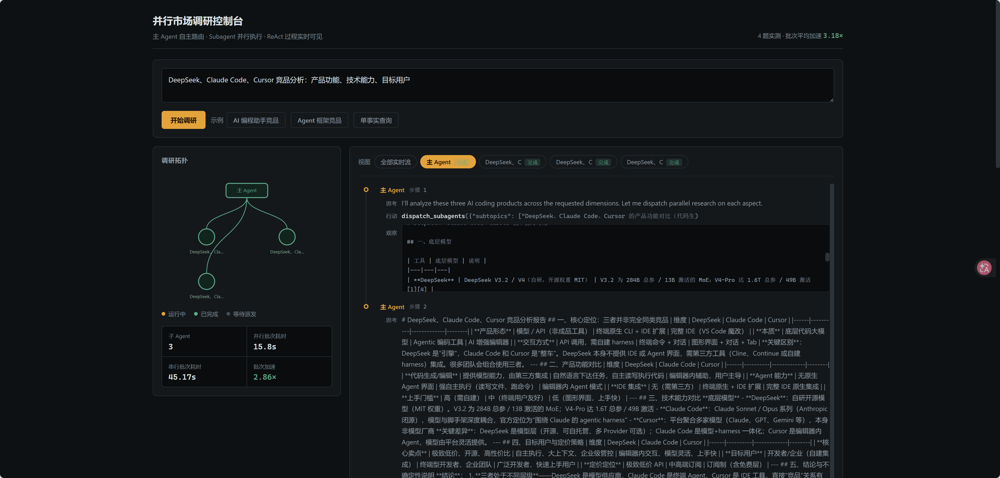

# Agent Fanout · 并行市场调研（Orchestrator-Workers）

主 agent 自主路由 + 多 subagent 并行调研的编排实现。主 agent 是一个 ReAct 循环，根据问题复杂度决定自行搜索还是派发 N 个 subagent 并行调研；每个 subagent 同为独立的 ReAct 循环。全过程经 SSE 流式推送到浏览器，拓扑展开与各节点的 ReAct 过程实时可见。

核心指标：**把 N 个独立子任务的墙钟时间从 sum 压到 ≈max**。4 题实测，subagent 批次平均加速 **3.18×**（端到端 2.67×，见「五、实测结果」）。

---

## 一、架构

```
                    ┌─────────────────────────────────────┐
   用户提问  ──────▶ │  主 Agent（ReAct 循环，max_steps=10） │
                    │  工具：web_search / dispatch_subagents│
                    └──────────────┬──────────────────────┘
                                   │ LLM 自主决策
                   ┌───────────────┴───────────────┐
                   ▼                               ▼
            web_search                    dispatch_subagents
        （单一事实问题，自行搜索）      （多侧面问题，派发并行）
                                                   │
                              ┌────────────────────┼────────────────────┐
                              ▼                    ▼                    ▼
                        subagent 1            subagent 2           subagent N
                        (ReAct, 8步)          (ReAct, 8步)         (ReAct, 8步)
                        仅 web_search         仅 web_search        仅 web_search
                              └────────────────────┼────────────────────┘
                                                   ▼
                                    ThreadPoolExecutor 并行收齐
                                                   ▼
                                        汇总 → 主 agent 综合成报告
```

拓扑在运行时动态确定：派发数量与子课题划分均由主 agent 决定，不固定。

### 设计要点

| 机制 | 位置 | 说明 |
|---|---|---|
| 通用 ReAct 引擎 | `react_loop.py` | 主 agent 与 subagent 共用同一循环，差异仅在挂载的工具集合 |
| 共享状态 | `agents.py` `State` | 一次调研一份 State（`/query` 为并发端点，不可用模块级单例）；工具经闭包持有它，引擎对 State 无感知 |
| 并行执行 | `agents.py` `_dispatch_subagents` | `ThreadPoolExecutor` 并行；`serial=True` 退化为 for 循环串行，用作基准测试基线 |
| 进度回调 | `on_main_step` / `on_dispatch` / `on_subagent_step` / `on_subagent_done` | 默认 `None` 时静默；由 `serve.py` 注入，将 agent 内部进度转为 SSE 事件 |
| 流式推送 | `serve.py` | agent 运行于后台线程，回调将事件写入 `queue.Queue`，生成器逐条 yield 为 `data: {...}` |

---

## 二、可视化



界面实时展示：主 agent 每步的 Thought/Action/Observation、派发时拓扑动态增加节点、多个 subagent 同时推进各自的 ReAct 步骤（点击节点可查看该 subagent 的完整过程），以及最终的并行加速统计。

---

## 三、目录结构

```
agent-fanout/
├── src/
│   ├── react_loop.py      # 通用 ReAct 循环引擎（function calling 版，无额外依赖）
│   ├── agents.py          # 主 agent + dispatch_subagents 并行编排 + State
│   ├── llm_client.py      # DeepSeek（OpenAI 兼容）客户端，内置指数退避重试
│   ├── tavily_search.py   # Tavily 联网搜索封装（标准库 urllib，无 SDK 依赖）
│   ├── serve.py           # FastAPI + SSE 流式 HTTP 服务
│   └── eval_compare.py    # 并行 vs 串行基准测试
├── static/
│   ├── index.html         # 可视化页面（拓扑 + 事件流 + 报告）
│   └── viz/topology.js    # 拓扑渲染（原生 JS + SVG，无前端框架）
├── outputs/
│   └── eval_compare.json  # 基准测试结果落盘
├── image.png              # 可视化界面截图
├── README.md
└── requirements.txt
```

---

## 四、快速开始

### 1. 安装

```bash
pip install -r requirements.txt
```

运行时依赖共三个：`openai`（LLM 走 OpenAI 兼容接口）、`fastapi`、`uvicorn`。
ReAct 引擎与拓扑可视化均为原生实现；搜索经标准库 `urllib` 调用 Tavily，不依赖 `tavily-python` SDK。

### 2. 配置环境变量

```bash
export DEEPSEEK_API_KEY=sk-xxx     # 必填，LLM
export TAVILY_API_KEY=tvly-xxx     # 必填，联网搜索
```

Windows PowerShell：

```powershell
$env:DEEPSEEK_API_KEY = "sk-xxx"
$env:TAVILY_API_KEY = "tvly-xxx"
```

### 3. 运行

```bash
python src/agents.py                  # 单次调研（CLI）
uvicorn src.serve:app --port 8002     # HTTP 服务 + 可视化
python src/eval_compare.py --limit 2  # 并行 vs 串行基准测试
```

---

## 五、实测结果

4 个多侧面问题，每题分别以并行、串行各跑一次。加速比按**派发批次**口径计算（`serial_sum / dispatch_wall`），即只衡量 subagent 并行这一段的收益：

| # | 问题 | subagent 数 | 批次·并行 | 批次·串行 | 加速 |
|---|---|---|---|---|---|
| 1 | DeepSeek、Claude Code、Cursor 竞品分析：产品功能、技术能力、目标用户 | 3 | 19.76 s | 41.70 s | 2.11× |
| 2 | 国产大模型 API 竞品分析：调用价格、上下文长度、推理能力 | 3 | 23.06 s | 67.08 s | 2.91× |
| 3 | AI Agent 框架竞品分析：LangGraph、AutoGen、CrewAI 的能力边界与适用场景 | 6 | 21.61 s | 104.14 s | **4.82×** |
| 4 | 开源大模型竞品分析：技术路线、生态、商用许可 | 3 | 23.96 s | 68.72 s | 2.87× |
| | **平均** | | | | **3.18×** |

```
Q1  (3 个 subagent)  █████████               2.11×
Q2  (3 个 subagent)  ████████████            2.91×
Q3  (6 个 subagent)  ████████████████████    4.82×
Q4  (3 个 subagent)  ████████████            2.87×
```

端到端平均耗时（含主 agent 自身的推理、派发决策与综合成文）：并行 **27.22 s** vs 串行 **72.73 s**，加速 2.67×。原始数据见 `outputs/eval_compare.json`。

### 结果分析

1. **加速比随 subagent 数量增长**：3 个子任务时 2.1~2.9×，6 个子任务时 4.82×。并行压缩的是 wall-clock，子任务越多、单个越慢，收益越大。
2. **批次耗时在并行侧稳定（19.8~24.0 s），串行侧波动显著（41.7~104.1 s）**：并行下批次耗时 ≈ 最慢的子任务，串行下则为所有子任务之和，加速上限因而受最慢子任务约束。
3. **批次加速高于端到端加速**（3.18× vs 2.67×）：并行只作用于 subagent 批次；主 agent 的推理、派发决策与最终成文是固定串行开销，不随 subagent 数量摊薄，在端到端口径下被稀释。

---

## 六、关键实现说明

### 回调的注入方式

`run_research()` 的四个 `on_*` 参数默认均为 `None`，不传即无操作，因此 `python src/agents.py` 这类 CLI 用法不会感知其存在。

工具函数由模型调用：引擎以 `tool.fn(**args)` 执行，`args` 来自模型返回的 `tool_calls`，形参名必须与 `Tool.parameters` 中的 JSON Schema 严格对齐。由于该 Schema 会提交给模型，`state` 与回调不能出现在其中。因此二者只在构造工具时经闭包注入，不进入调用签名。

回调传递链：

```
serve.py  run_research(on_dispatch=...)
   └─ agents.py  make_dispatch_tool(state, on_dispatch=...)     ← 闭包捕获
        └─ agents.py  Tool(fn=lambda subtopics: _dispatch_subagents(...))  ← 再次捕获
             └─ agents.py  on_dispatch(dispatch_info)           ← 实际调用点
```

### SSE 事件类型

前端按 `ev.type` 分发（`static/index.html`）：

| type | 含义 |
|---|---|
| `start` | 开始，回显问题 |
| `main_step` | 主 agent 的某一步。工具执行前后各发送一次：先发决策（observation 为空），执行完成后以同一 idx 补发并携带 observation，调用方原地更新该条目 |
| `dispatch` | 主 agent 决定派发，携带真实 subagent id，前端据此增加拓扑节点 |
| `subagent_step` | 某个 subagent 的某一步 |
| `subagent_done` | 某个 subagent 完成，携带耗时 |
| `final` | 最终报告 + `parallel_stats` |
| `error` | 异常（截断至 200 字符回传，避免前端无响应） |
| `done` | 流结束标记 |

### 防御性上限

- **主 agent 最多 10 步、每个 subagent 最多 8 步**（`react_loop.py` 的 `max_steps`）。达到上限仍在调用工具时返回兜底答案，不返回空结果。
- **单次派发最多 6 个 subagent**（`agents.py`）。防止模型一次拆出过多子课题导致并发与 API 额度失控。

### 错误处理

`ReActLoop._exec_tool` 将四类失败（参数不是合法 JSON / 参数不是 JSON 对象 / 工具不存在 / 工具执行抛异常）一律作为**观察结果**回灌给模型，不向外抛异常中断循环。错误信息对模型本身即是有效的反馈信号，保留其自我纠错的机会。

---

## 七、常见问题

**单次调用的额度开销？** 主 agent 通常 2 步，每个 subagent 最多 8 步。完整基准测试的规模见上表；`python src/eval_compare.py --limit 2` 可先小规模验证。

**`/health` 返回 `tavily: false`？** 环境变量未设置或未在当前 shell 生效。`serve.py` 为独立进程，需要其运行环境中存在这两个 key。

**为什么没有采用 LangGraph / CrewAI 等编排框架？** 编排逻辑（`agents.py`）与 ReAct 引擎（`react_loop.py`）均为原生实现，便于完整控制并直接暴露路由决策、并行调度与事件推送的细节，不引入框架层的额外抽象。